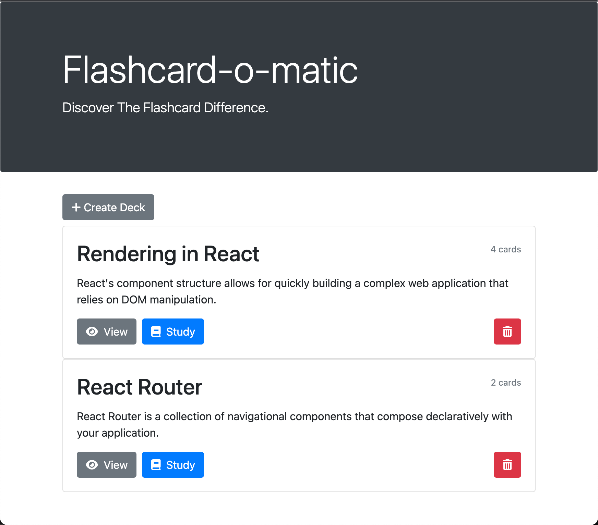
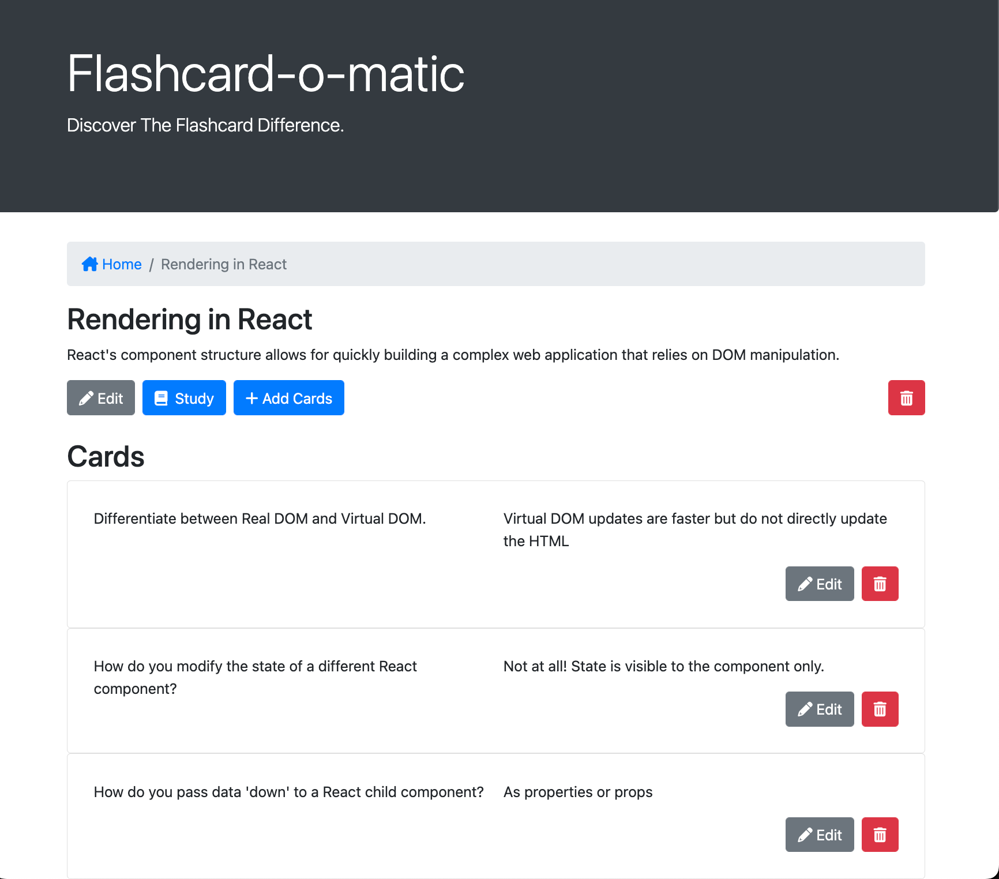
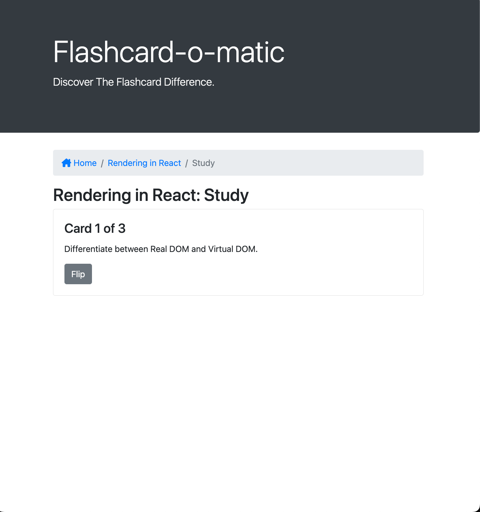
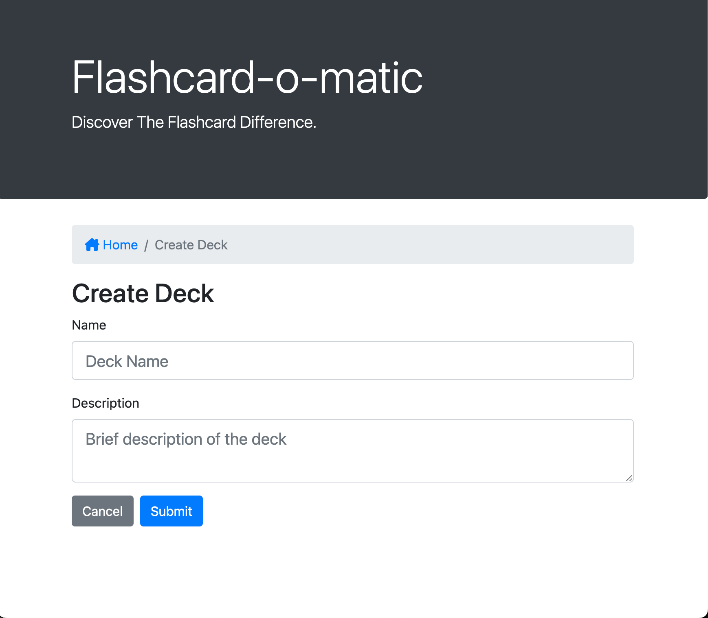

# Flashcard-o-matic

[view live app here]tbd)

## Table of Contents
- [Description](#description)
- [Screenshots](#screenshots)
- [Technical](#technical)
- [Installation Instructions](#installation-instructions)
- [Troubleshooting](#troubleshooting)

## Description
This project focused on utilizing React hooks, reusable components, and passing props to components to build a web application that can dynamically share and preserve data that is fetched from an API. This web application allows users to create a flashcard deck, cards for their deck, click through their deck to study the cards, and edit or delete their decks and cards.

## Screenshots
Dashboard

View Deck

Study Deck

Create Deck

## Technical

- Created using React
- Features a mock back-end API.
- Utilizes Bootstrap

## Installation Instructions

1. Clone Repo
2. Open the folder in your Terminal
3. Run "npm i" || "npm install"
4. After installation completes, run "npm start".

## Troubleshooting

- If starting the project fails, the port number inside of ./src/utils/api/index.js @ Line 5 may need to be changed to another port.
- If changing the port in the /api/index.js did not work, environment variables may need to be changed to different ports for the back-end and front-end to start fully.
